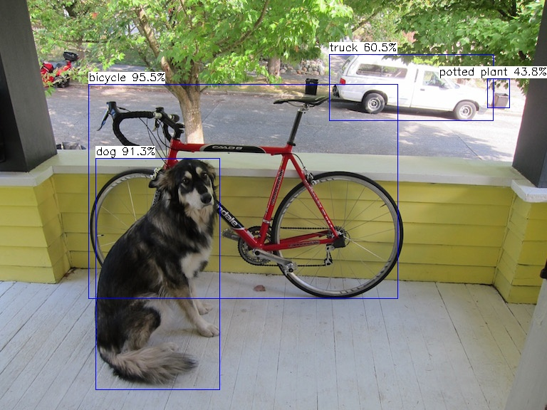

# YOLOX.MNN
YOLOX object detector MNN  C++ Project

## Introduction
- [YOLOX](https://github.com/Megvii-BaseDetection/YOLOX)  [MNN](https://github.com/alibaba/MNN) C++ Project

## run code
- option: main.cpp: model path and image path
```
mkdir build 
cd build
cmake .. 
make
```

## demo result
 